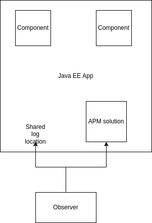
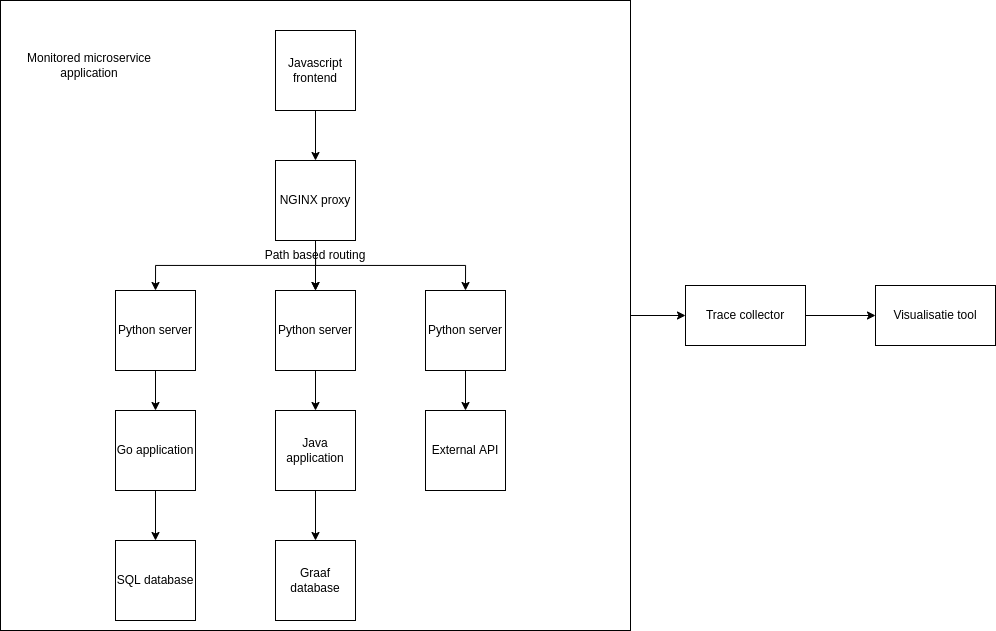
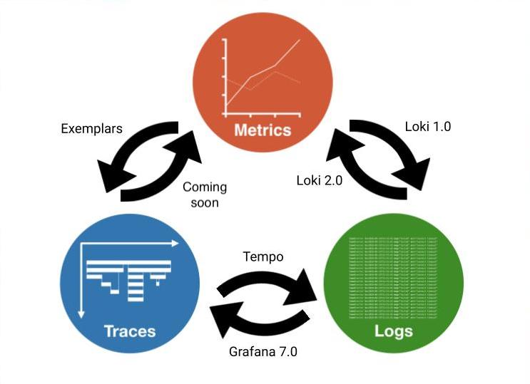

# APM (Application Performance Monitoring)

## Introductie
(Over Teuno en Thijs)

## Inhoud
1. Wat is APM
2. Het probleem waar APM je bij kan helpen
3. Hoe werkt APM
4. Geschiedenis
5. Verschillende tooling en technieken
6. Opdrachten

## 1. Wat is APM en wat kun je er mee bereiken.
APM staat voor Application Performance Monitoring. Dit kun je toepassen in je applicatie landschap om beter inzicht te krijgen in de performance van je applicaties. 
Het bestaat uit verschillende onderdelen (waar we later op terug komen) die er voor zorgen dat activiteiten over je gehele landschap gevolgd kunnen worden. 

## 2. Het probleem waar APM je bij kan helpen
In onderstaande afbeelding hebben wij een voorbeeeld waarin APM erg helpvol zou kunnen zijn. In deze applicatie begint een activiteit vanuit de browser, in de frontend applicatie. De backend bekijkt vervolgens of iets in de database aanwezig is. Zo niet, dan worden gegevens van een derde partij opgevraagd en opgeslagen. Uiteindelijk krijgt de gebruiker weer feedback.

Gebruikers klagen bij het gebruik van deze applicatie. Hij is namelijk erg traag. Voor jou als ontwikkelaar is het nog niet gemakkelijk om er achter te komen waar het probleem zit. Het moment om APM toe te passen.

## 3. Hoe werkt APM
application performance monitoring is een onderdeel van observability, net als logging en metrics.
Ieder event in de applicatie krijgt een uniek ID mee. De gehele tijd dat dit ID geldig is, wordt een trace genoemd. Onder een trace vallen spans. Onder spans kunnen weer meerdere events vallen. Bij spans moet je denken aan onderdelen van een applicatie waar een trace allemaal doorheen gaat. Bijvoorbeeld een controller, een repository of een database query. Traces kunnen worden gevolgd over meerdere applicaties.

## 4. Geschiedenis
In het verleden waren APM tools voornamelijk geinteresseert in CPU, Memory.

 

Als je op een cloud draait wordt dit tegenwoordig standaard al voor je verzamelt, kunt het weergeven in diagrammen of hier acties op ondernemen. 
Tegenwoordig zijn APM tools meer gericht op latency en applicatie uptime. Ook zijn de systemen die worden gemonitort vaker in meerdere talen geschreven en draaien ze op verschillende locaties. Dit geeft nieuwe problemen. Voor het monitoren zijn bijvoorbeeld agents in verschillende talen nodig en ze moeten hun gegevens over het netwerk ergens naar toe kunnen schrijven, zodat het aan elkaar gekoppeld kan worden.

## 5. Verschillende tooling en technieken
Voor tracing hadden vendors en projecten eerst allemaal een eigen manier van het verzamelen van traces.
Hierdoor kon er moeilijker overgestapt worden van de ene tool naar de ander. Ook zou het zo kunnen zijn dat 1 applicatie gemonitord werd met de ene tool en een ander met een andere tool en dan zouden de traces niet aan elkaar gekoppeld kunnen worden. Om dit probleem op te lossen zijn er tracing standaarden ontwikkeld. Eerst waren er OpenTracing en OpenCensus en deze zijn onlangs samengevoegd in  het tracing onderdeel van OpenTelemetry. OpenTelemetry heeft ook nog standaarden voor logging en metrics, maar is nog niet volledig af. Er is op dit moment ook een Trace context recommendation met daarin standaard HTTP headers voor W3C.

Traces van een applicatie kunnen direct naar een APM solution gestuurd worden. Als je gebruik maakt van OpenTelemetry kun je er ook voor kiezen de logs in een collector te verzamelen en dan door te sturen naar 1 of meerdere APM solutions (Dit is ook te zien bij de opdrachten straks). Ook zou je in de collecter in een process stap bewerkingen op traces kunnen doen (bijvoorbeeld droppen van bepaalde traces).

Wanneer je de traces hebt verzamelt kun je deze visualiseren. Een aantal voorbeelden van applicaties die traces voor je kunnen visualiseren zijn:
- Jaeger
- Kibana
- Grafana
- Zipkin

In sommige van deze tools kun je ook een koppeling maken met de applicatie logs die zijn gemaakt terwijl een trace bezig was. Ook kun je soms een link maken met metrics die op dit moment gemaakt zijn.

Hier is een schema van hoe Grafana de links tussen traces, metrics en logs maakt.
En manier van het verbinden van de gegevens zit ook in veel commerciele APM oplossingen.

## 6. Opdrachten
De opdrachten voor deze sessie is om application performance monitoring toe te voegen aan een bestaande applicatie. Hiervoor hebben we een blogger applicatie opgezet. Deze blogger applicatie bestaat uit een frontend geschreven in Angular. Twee backend applicaties voor het schrijven en lezen van de blogs. En een Postgres database waar de blogs in staan. Deze blog applicatie heeft echter een probleem. Af en toe komen de blogs niet op de frontend terecht. Wie in de backend code kijkt zal vrij snel zien waardoor dit komt, maar we proberen hiermee een echt scenario na te bootsen die voor zou kunnen komen. Door het toevoegen van APM kun je zien hoe deze tools je er bij kunnen helpen in de toekomst gemakkelijk problemen in de applicatie te tackelen. 