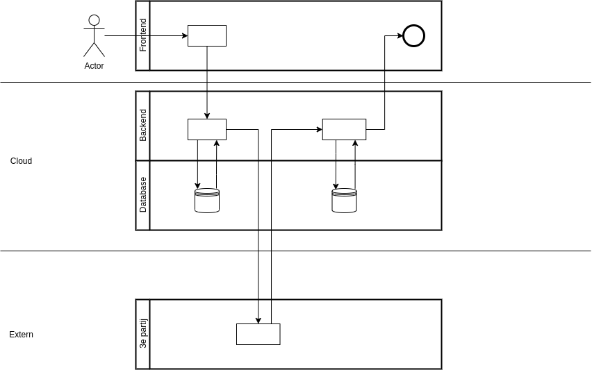
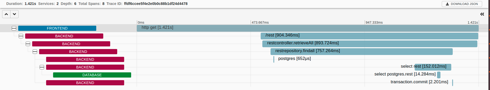

# APM (Application Performance Monitoring)

## Introductie
(Over Teuno en Thijs)

## Inhoud
1. Wat is APM
2. Het probleem waar APM je bij kan helpen
3. Hoe werkt APM
4. Geschiedenis
5. Verschillende tooling en technieken
6. Opdrachten

## 1. Wat is APM en wat kun je er mee bereiken.
APM staat voor Application Performance Monitoring. Dit kun je toepassen in je applicatie landschap om beter inzicht te krijgen in de performance van je applicaties. 
Het bestaat uit verschillende onderdelen (waar we later op terug komen) die er voor zorgen dat activiteiten over je gehele landschap gevolgd kunnen worden. 

## 2. Het probleem waar APM je bij kan helpen
In onderstaande afbeelding hebben wij een voorbeeeld waarin APM erg helpvol zou kunnen zijn. In deze applicatie begint een activiteit vanuit de browser, in de frontend applicatie. De backend bekijkt vervolgens of iets in de database aanwezig is. Zo niet, dan worden gegevens van een derde partij opgevraagd en opgeslagen. Uiteindelijk krijgt de gebruiker weer feedback.

Gebruikers klagen bij het gebruik van deze applicatie. Hij is namelijk erg traag. Voor jou als ontwikkelaar is het nog niet gemakkelijk om er achter te komen waar het probleem zit. Het moment om APM toe te passen.

## 3. Hoe werkt APM
application performance monitoring is een onderdeel van observability, net als logging en metrics.
Ieder event in de applicatie krijgt een uniek ID mee. De gehele tijd dat dit ID geldig is, wordt een trace genoemd. Onder een trace vallen spans. Onder spans kunnen weer meerdere events vallen. Bij spans moet je denken aan onderdelen van een applicatie waar een trace allemaal doorheen gaat. Bijvoorbeeld een controller, een repository of een database query. Traces kunnen worden gevolgd over meerdere applicaties.

## 6. Opdrachten
De opdrachten voor deze sessie is om application performance monitoring toe te voegen aan een bestaande applicatie. Hiervoor hebben we een blogger applicatie opgezet. Deze blogger applicatie bestaat uit een frontend geschreven in Angular. Twee backend applicaties voor het schrijven en lezen van de blogs. En een Postgres database waar de blogs in staan. Deze blog applicatie heeft echter een probleem. Af en toe komen de blogs niet op de frontend terecht. Wie in de backend code kijkt zal vrij snel zien waardoor dit komt, maar we proberen hiermee een echt scenario na te bootsen die voor zou kunnen komen. Door het toevoegen van APM kun je zien hoe deze tools je er bij kunnen helpen in de toekomst gemakkelijk problemen in de applicatie te tackelen. 